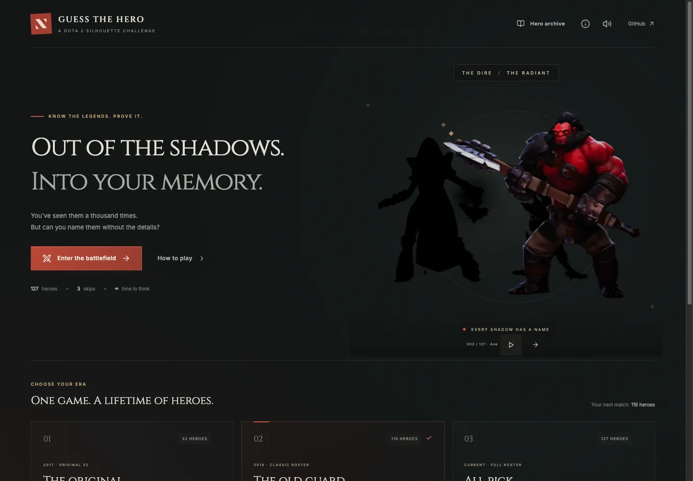

# Guess the Hero — web

An unofficial Dota 2 silhouette game rebuilt from the original Android app. React + Vite, Tailwind v4, accessible Radix/shadcn-style source-owned UI primitives, Lucide icons. No backend, accounts, analytics, or paid services.

## Play

https://debanjanc01.github.io/guess-the-hero/



- **Original:** all 32 original silhouettes and reveal images.
- **Classic:** the 116-hero December 2018 roster. Original artwork where available; current transparent silhouettes elsewhere, explicitly labeled. Archived 2018 portraits appear after revealing and in the archive.
- **All Pick:** all 127 heroes in the verified Valve roster snapshot, including Kez, Ringmaster, and Largo.
- **New Blood:** 11 heroes introduced after the classic roster snapshot.

On phones/touch screens, the game uses a compact viewport-aware layout. It does not auto-open the keyboard. The silhouette, 16px answer input (avoiding Safari focus zoom), and Guess button remain together above the keyboard, using the browser's VisualViewport API to handle keyboard resize and pan. Desktop keyboard autofocus remains available.

Correct answer: +10 points. Three skips per match. Wrong guesses have no penalty. Names, common aliases, spacing, case, and punctuation are normalized. A skipped hero is revealed before moving on. When skips run out, the skip control is disabled rather than unexpectedly ending the game. GG saves your score and ends the match. High scores are local to the browser, independently per roster.

Audio plays only on reveal or an explicit replay. The mute preference is saved. Io, Phoenix, Marci, and Primal Beast use their actual vocalizations/whistles/roars rather than invented speech. No timers; restrained reveal motion respects reduced-motion preferences. The landing showcase uses a lazy-loaded Three.js carousel via **React Three Fiber + Drei**, not a custom animation engine. Drei's built-in OrbitControls handles automatic horizontal rotation and drag interaction; Billboard keeps the existing hero cutouts facing the camera. Near heroes brighten and far heroes become silhouettes through Three.js lighting. Pause/resume, offscreen/tab suspension, reduced-motion static art, and a WebGL-unavailable fallback keep it usable.

## Development

Node 22+:

```sh
cd web
npm ci
npm run dev
```

Open http://127.0.0.1:5173/guess-the-hero/.

```sh
npm test
npm run assets:verify
npm run build
npm run preview
```

## Structure

- `src/game.js`: small immutable state transitions, object-based answer dictionaries, Fisher–Yates ordering.
- `src/useGameViewport.js` / `src/mobile-game.css`: keyboard-aware mobile battlefield layout.
- `src/data/heroes.json`: keyed hero records, asset provenance, signature quotes, and historical verification metadata.
- `src/App.jsx`: landing, game, results, rules, and searchable hero archive.
- `src/components/ui.jsx`: customizable button/input/dialog primitives; Radix handles focus trapping, Escape, and screen-reader semantics.
- `src/components/HeroOrbit.jsx` / `OrbitScene.jsx`: accessible showcase wrapper and lazily loaded Drei/Three.js scene. Labels remain in a separate HTML overlay so artwork never hides them.
- `public/assets/`: frozen, optimized local media. No runtime third-party asset dependencies.
- `research/`: source snapshots and checksum ledger.
- `tests/`: gameplay regression tests.

3D library documentation: [React Three Fiber](https://r3f.docs.pmnd.rs/), [Drei controls](https://drei.docs.pmnd.rs/controls/introduction), [Drei Billboard](https://drei.docs.pmnd.rs/abstractions/billboard). All three libraries (including Three.js) are MIT-licensed.

The only gameplay ordering array is the shuffled hero-ID sequence. Names, image references, voices, accepted aliases, results, and high scores use keyed objects. No parallel arrays, repeated `contains` scans, random retry loops, or chained array transformations in the main logic. UI lists still use normal React rendering methods.

## Assets

See [ASSETS.md](ASSETS.md) for provenance, caveats, and usage rights. The original Android files in `../main/` are untouched.

All media is already checked in; builds **do not** scrape or depend on upstream availability. To re-source the pinned set, optionally use Python + Pillow + ffmpeg:

```sh
python3 -m pip install Pillow
python3 scripts/source-assets.py
npm run assets:verify
```

The script caches downloads in ignored `.asset-cache/`, validates existing images, atomically writes optimized WebP images, and converts two WAV sources to real MP3s. Metadata comes from a pinned Dotabase revision. Official roster updates are deliberate: refresh the source snapshots, review new media, then regenerate and test. "Current" denotes a verified snapshot, not a live service that silently changes.

## Hosting

GitHub Pages is free for this public repository and needs no separate provider account. `.github/workflows/pages.yml` tests, verifies checksums, builds, and deploys on `master` pushes. GitHub repository Settings → Pages must use **GitHub Actions** as the source. Vite's base is `/guess-the-hero/`, so assets work on the repository subpath and the app does not need SPA rewrite rules.

For another repository name or a custom domain, change `base` in `vite.config.js`. This is entirely static and can also be hosted on Cloudflare Pages (`web` root, `npm run build`, `dist` output).

## Limitations

This is a casual client-side quiz, not an anti-cheat leaderboard. Asset filenames and hero records can be inspected in browser tools. Saved records do not sync between devices. Valve media rights are separate from open-source UI dependencies; attribution is not a replacement for permission.
